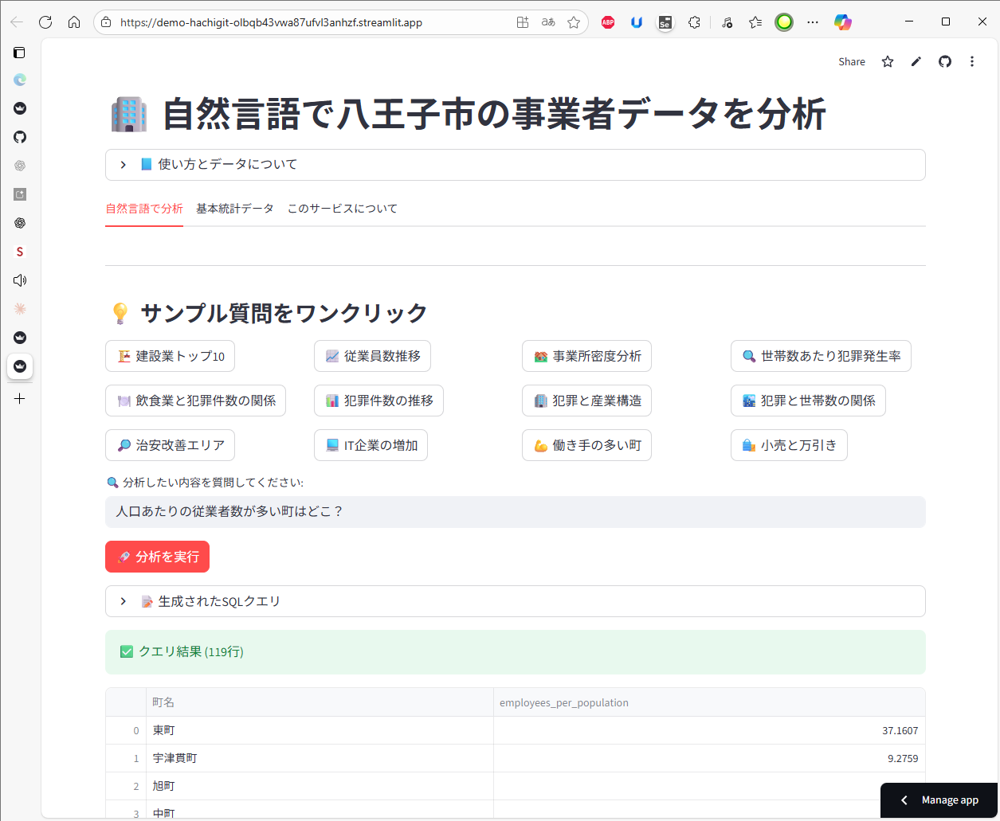

# 八王子市 複合データ分析アプリ

自然言語での質問や、年度別の統計データを通じて、八王子市の事業者・人口・犯罪データを多角的に分析・可視化するStreamlitアプリケーションです。

GoogleのGemini APIを利用してユーザーの質問をDuckDBのSQLクエリに変換する機能と、予め定義されたクエリで統計データを表示する機能を備えています。



## 主な機能

本アプリケーションは、3つの主要なタブで構成されています。

### 1. 自然言語で分析

「2021年の建設業の事業所数が多い町トップ5は？」のような日常的な言葉で質問すると、AIがデータを分析して結果を返します。

- **AIによるSQL自動生成**: Gemini APIが質問を解釈し、SQLクエリを生成します。
- **結果の多角的な表示**: クエリ結果を表で示すだけでなく、AIによる要約コメントや、棒グラフ・地図による可視化も行います。
- **サンプル質問UI**: クリック可能なボタン形式でサンプル質問を提示し、手軽に分析を試せます。ボタンにマウスオーバーすると質問の全文が表示されます。

### 2. 基本統計データ

市全体の年度別統計データをグラフと表で確認できます。

- **主要指標の推移**: 「事業所数・従業員数」「世帯数・人口」「犯罪件数」の3つの指標の経年変化を線グラフで表示します。
- **町名別データの地図表示**: 上記のデータを特定の年度で絞り込み、町名ごとの分布を地図上で色分けして確認できます。

### 3. このサービスについて

アプリケーションの運営会社情報と、利用しているデータソースの詳細を掲載しています。

## 利用データ

本サービスでは、以下のオープンデータを活用しています。

- **統計八王子（各年版）**
  - **参照内容**: 事業所数、世帯数 (2015～2024年)
  - **ソース**: [統計八王子（各年版）｜八王子市公式ホームページ](https://www.city.hachioji.tokyo.jp/shisei/002/006/tokehachihkakunen/)

- **区市町村の町丁別、罪種別及び手口別認知件数**
  - **参照内容**: 区市町村の町丁別、罪種別及び手口別認知件数 (2015～2024年)
  - **ソース**: [警視庁](https://www.keishicho.metro.tokyo.lg.jp/about_mpd/jokyo_tokei/jokyo/ninchikensu.html)

- **統計地理情報システム（e-Stat）**
  - **参照内容**: 八王子市の市区町村境界データ (2020年)
  - **ソース**: [政府統計の総合窓口](https://www.e-stat.go.jp/gis/statmap-search?page=1&type=2&aggregateUnitForBoundary=A&toukeiCode=00200521&toukeiYear=2020&serveyId=A002005212020&datum=2000)

## 技術スタック

- Python
- Streamlit
- DuckDB
- Google Gemini API
- Pandas
- Geopandas
- Folium
- uv (Pythonパッケージ管理)

## セットアップと実行方法

### 1. 前提条件
- Python 3.13以上
- [uv](https://github.com/astral-sh/uv) （高速なPythonパッケージインストーラー）
- Google Gemini APIキー

### 2. リポジトリのクローン

```bash
git clone https://github.com/your-username/your-repository-name.git
cd your-repository-name
```

### 3. 必要なライブラリのインストール

`uv` を使って、`pyproject.toml` と `uv.lock` から依存関係をインストールします。

```bash
uv pip sync
```

### 4. APIキーの設定

プロジェクトのルートディレクトリに `.streamlit` フォルダを作成し、その中に `secrets.toml` ファイルを配置します。ファイルに以下の内容を記述してください。

```toml
# .streamlit/secrets.toml
GOOGLE_API_KEY = "YOUR_GOOGLE_API_KEY"
```
`YOUR_GOOGLE_API_KEY` はご自身のAPIキーに置き換えてください。

### 5. アプリケーションの実行

```bash
streamlit run app.py
```

## 免責事項

- このアプリケーションが生成するSQLクエリはAIによって作られており、必ずしも正確または最適であるとは限りません。
- 生成された情報は、正確性を保証するものではありません。参考情報としてご利用ください。